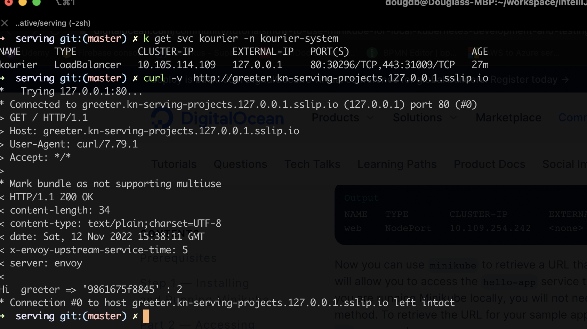

= Knative CookBook

== Links

- https://knative.dev/docs/[Knative]
- https://knative.dev/docs/install/quickstart-install/[Install Knative using quickstart]
- https://gist.github.com/rahulkumar-aws/65e6fbe16cc71012cef997957a1530a3[Install/Remove Minikube]
- https://medium.com/@seohee.sophie.kwon/how-to-run-a-minikube-on-apple-silicon-m1-8373c248d669[Install Minikube Mac M1]
- https://knative.dev/docs/install/yaml-install/[Knative Installation]
- https://github.com/redhat-developer-demos/knative-tutorial/tree/knative-cookbook[Knative Cookbook Git Repo]
- https://github.com/redhat-developer-demos/knative-minishift[Knative on Minishift v1]
- https://developers.redhat.com/blog/2019/04/09/from-zero-to-quarkus-and-knative-the-easy-way#prerequisites[Knative on Minishift v2]
- https://192.168.42.25:8443/console[Local OKD]
- https://github.com/openshift-cloud-functions/minishift-addons[Minishift Knative addons]
- https://medium.com/google-cloud/knative-serving-0-7-96e6d7be463e[Knative Serving 0.7]

. https://codelabs.developers.google.com/codelabs/knative-intro#8[Serving multiple versions simultaneously]

. https://knative.dev/docs/eventing/custom-event-source/containersource/#create-a-containersource-object
. https://github.com/hguerrero/amq-examples/tree/master/kafka-demo/src/main/java/com/redhat/kafkademo
. https://developers.redhat.com/blog/2018/10/29/how-to-run-kafka-on-openshift-the-enterprise-kubernetes-with-amq-streams#test_using_an_external_application

. https://github.com/kubernetes/minikube/releases[Minikube Releases]
. https://piotrminkowski.com/2021/03/12/knative-eventing-with-kafka-and-spring-cloud/[Knative On Spring Cloud]
. https://knative.dev/docs/eventing/sources/kafka-source/[Knative Kafka Source]
. https://knative.dev/docs/eventing/configuration/kafka-channel-configuration/#create-a-kafka-channel-configmap[Knative Kafka Channel]

== Knative major concepts

. Knative is a Kubernetes-based platform that helps to run your serverless work‐loads in the BaaS way
. Knative was started with the simple goal of having a Kubernetes-native platform to build, deploy, and manage your serverless workloads
. On Knative you can deploy any modern application workload, such as monolithic applications, microservices, or even tiny functions
. Like any other Kubernetes resource, a Knative Serving Service can be deployed using a resource YAML file.
As you will see, the resource YAML is similar to a Kubernetes Deployment but with a few attributes removed.

== Minikube Configuration

[source,bash]
----
minikube config set cpus 4
minikube config set memory 8192

minikube start
minikube start --driver=docker --alsologtostderr

minikube addons enable registry

# !!! IMPORTANT to Kourier Ingress !!!
minikube tunnel
k get pods -n kube-system

----

.Minikube LoadBalancer communication Enabled by Tunnel

== Install Knative Serving v1.8.0

[source,bash]
----
k apply \
  --filename https://github.com/knative/serving/releases/download/knative-v1.8.0/serving-crds.yaml \
  --filename https://github.com/knative/eventing/releases/download/knative-v1.8.0/eventing-crds.yaml
k api-resources --api-group='serving.knative.dev'
k api-resources --api-group='messaging.knative.dev'
k api-resources --api-group='eventing.knative.dev'
k api-resources --api-group='sources.knative.dev'

k apply \
  --filename \
  https://github.com/knative/serving/releases/download/knative-v1.8.0/serving-core.yaml

k rollout status deploy controller -n knative-serving
k rollout status deploy activator -n knative-serving
k rollout status deploy autoscaler -n knative-serving
k rollout status deploy webhook -n knative-serving

k get pods -n knative-serving

k apply \
  --filename \
    https://github.com/knative/net-kourier/releases/download/knative-v1.8.0/kourier.yaml

k rollout status deploy 3scale-kourier-control -n knative-serving
k rollout status deploy 3scale-kourier-gateway -n kourier-system
#
k get pods --all-namespaces -l 'app in(3scale-kourier-gateway,3scale-kourier-control)'

k patch configmap/config-network \
  -n knative-serving \
  --type merge \
  -p '{"data":{"ingress.class":"kourier.ingress.networking.knative.dev"}}'
#
k apply \
  --filename https://projectcontour.io/quickstart/contour.yaml
#
k rollout status ds envoy -n projectcontour
k rollout status deploy contour -n projectcontour
k get pods -n projectcontour

# Ingress to Kourier Ingress Gateway:

cat <<EOF | kubectl apply -n kourier-system -f -
apiVersion: networking.k8s.io/v1
kind: Ingress
metadata:
  name: kourier-ingress
  namespace: kourier-system
spec:
  rules:
  - http:
     paths:
       - path: /
         pathType: Prefix
         backend:
           service:
             name: kourier
             port:
               number: 80
EOF

#
ksvc_domain="\"data\":{\""$(minikube -p kn-serving-projects ip)".nip.io\": \"\"}"
#
k patch configmap/config-domain \
    -n knative-serving \
    --type merge \
    -p "$ksvc_domain"
----

== Install Knative Eventing v1.8.0
[source, bash]
----
k apply \
  --filename \
  https://github.com/knative/eventing/releases/download/knative-v1.8.0/eventing-core.yaml \
  --filename \
  https://github.com/knative/eventing/releases/download/knative-v1.8.0/in-memory-channel.yaml \
  --filename \
  https://github.com/knative/eventing/releases/download/knative-v1.8.0/mt-channel-broker.yaml

k rollout status deploy eventing-controller -n knative-eventing
k rollout status deploy eventing-webhook  -n knative-eventing
k rollout status deploy imc-controller  -n knative-eventing
k rollout status deploy imc-dispatcher -n knative-eventing
k rollout status deploy mt-broker-controller -n knative-eventing
k rollout status deploy mt-broker-filter -n knative-eventing
k rollout status deploy mt-broker-filter -n knative-eventing

#

k get pods -n knative-eventing
----

== Enable Knative on Minishift

[source,bash]
----
# memory for the vm
minishift config set memory 8GB

# the vCpus for the vm
minishift config set cpus 4

# extra disk size for the vm
minishift config set disk-size 50g

# caching the images that will be downloaded during app deployments
minishift config set image-caching true

# Add new user called admin with password with role cluster-admin
minishift addons enable admin-user

# Allow the containers to be run with uid 0
minishift addons enable anyuid

# Start minishift
minishift start

eval $(minishift docker-env) && eval $(minishift oc-env)

#
oc login -u admin -p admin
oc login -u developer -p welcome1
----

== Enable SCCs (Security Context Constraints)

[source,bash]
----
oc project myproject
# Set privileged and anyuid scc to default SA in myproject
oc adm policy add-scc-to-user anyuid -z default -n myproject
oc adm policy add-scc-to-user privileged -z default -n myproject
----

== Deploy Knative commands

. API K8s used to deploy Knative on Minishift is *_serving.knative.dev/v1alpha1_*

[source,bash]
----
# same command to kubectl, the deploy take a slight more time that normal deploy
watch oc get pods
oc -n myproject get ksvc greeter
oc get configurations greeter
----

== Invoking the current

[source,bash]
----
k get ksvc greeter

# Istio Ingress
#!/bin/bash
KSVC_NAME=${1:-'greeter'}
IP_ADDRESS="$(minikube ip):$(k get svc istio-ingressgateway \
--namespace istio-system \
--output 'jsonpath={.spec.ports[?(@.port==80)].nodePort}')"

# Kourier Ingress
k get svc kourier -n kourier-system --output 'jsonpath={.spec.ports[?(@.port==80)].nodePort}'

# Sample Output
k get ksvc greeter
curl -H "Host:greeter-v1.kn-serving-projects.192.168.49.2.nip.io" 192.168.49.2:32338

curl -H "Host:$KSVC_NAME.chapter-2.example.com" $IP_ADDRESS
oc ip
watch -n 5 http greeter-00000-service-myproject.192.168.42.30.nip.io/
----

.Knative Service Invoked by Router from OKD

== _Knative Serving Interaction_

****
You should notice that if your ksvc pod called greeter is not inter‐ acted with (i.e., not called/invoked), it will terminate as Knative Serving will automatically #_scale-to-zero_# any Knative Service pods that are not being actively used.
If needed, $BOOK_HOME/bin/call.sh will wake up greeter, causing it to scale back up to an actively run‐ ning pod.
You can use watch kubectl get pods to monitor the pod lifecycle
****

[source,bash]
----
oc get revisions
----

== Knative Autoscaling features

. Scale out, means increase up your instances based on inbound HTTP traffic
. Knative Horizontal Pod Autoscaler (KPA)
. Horizontal Pod Autoscaler (HPA); the default autoscaler built into Kubernetes, HPA relies on three important metrics: concurrency, requests per second, and cpu

.Config-map file to configure Knative Service for Autoscaling
[source,yaml]
----
apiVersion: v1
data:
  container-concurrency-target-default: "100"
  enable-scale-to-zero: "true"
  stable-window: "60s"
  scale-to-zero-grace-period: "30s"
----

. This config-map exists on knative-serving ns, to check

[source,bash]
----
# kubectl or oc
oc -n knative-serving get cm config-autoscaler -o yaml
----

. #_The time period in which the requests are monitored for calls and metrics; defaults to 60 seconds_#
. #_The time period within which the inactive pods are terminated; defaults to 30 seconds_#
. When another request targets an inactive Revision, the activator intercepts that request and will instruct the Knative autoscaler to create new pods for that service Revision.
. Handle Requests Spikes
. Avoid Coldstart Latency with minScale and maxScale
. By default does not set an upper limit to the number of pods (maxScale fix this)

== Knative Serving

. Knative has two major subprojects: Serving and Eventing, with Serving you have dynamic autoscaling, including scaling down to zero pods, based on the absence of HTTP traffic load, and Eventing, you now have that same autoscaling capability but bridged into other protocols or from other sour‐ ces beyond HTTP

=== Usage Patterns

Source to Sink

 1.Source to Sink provides the simplest getting started experience with Knative
 2.Eventing. It provides single Sink—that is, event receiving service

Channels and Subscriptions

 With Channels and Subscriptions, the Knative Eventing system defines a Channel, which can connect to various backends, each Channel can have one or more Subscribers in the form of Sink Services

Brokers and Triggers

 Brokers and Triggers are similar to Channels and Subscriptions, except that they support filtering of events event filtering is a method that allows the Subscribers to show an interest in a certain set of messages that flows into the Broker

[source,bash]
----
kubectl api-resources --api-group='serving.knative.dev'
kubectl api-resources --api-group='messaging.knative.dev'
kubectl api-resources --api-group='eventing.knative.dev'

kubectl get svc kourier -n kourier-system --output 'jsonpath={.spec.ports[?(@.port==80)].nodePort}' kubectl -n knative-cookbook get ksvc greeter

curl -H "Host:greeter.knative-cookbook.example.com" 192.168.49.2:32498
----

=== Strimzi Kafka Cluster

[source,bash]
----
kubectl create namespace kafka
curl -L https://github.com/strimzi/strimzi-kafka-operator/releases/download/0.29.0/strimzi-cluster-operator-0.29.0.yaml | sed 's/namespace: .*/namespace: kafka/' | kubectl apply -f - -n kafka

watch kubectl get pods -n kafka

----